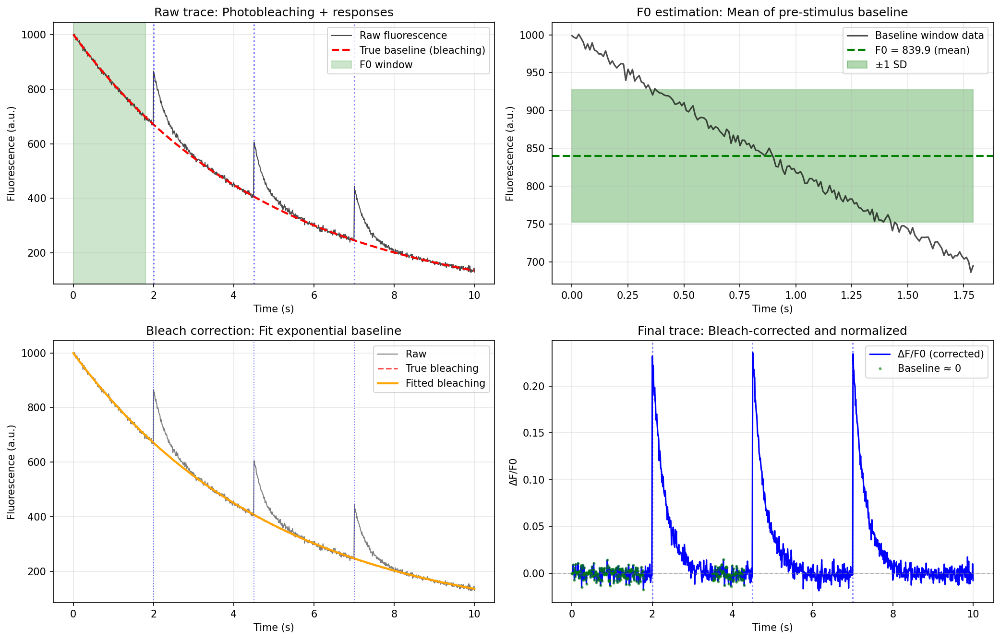
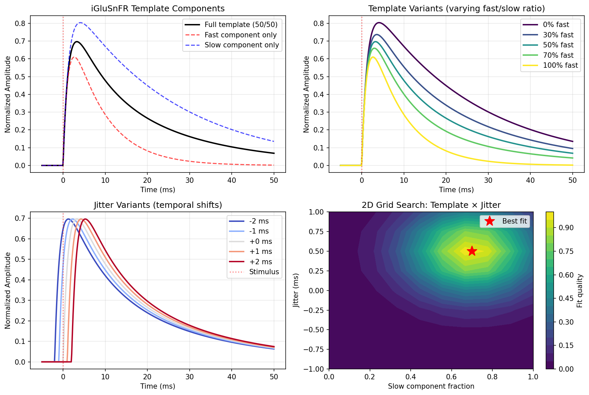
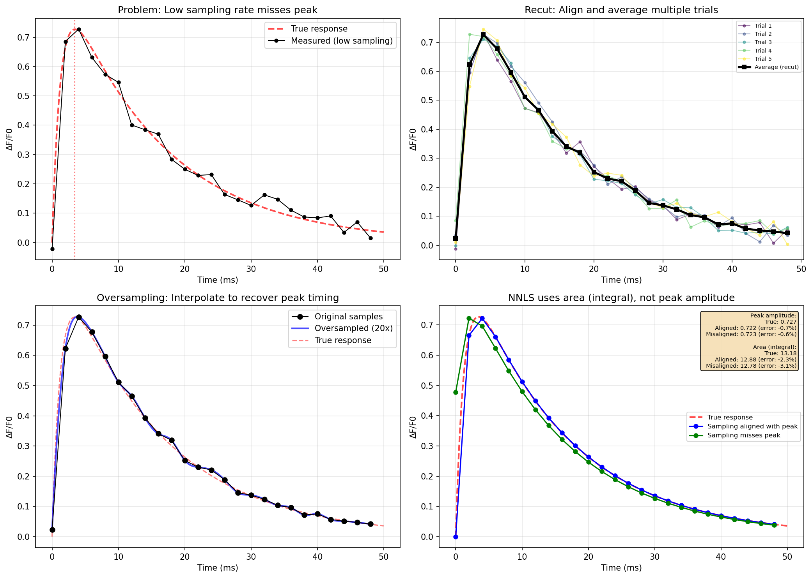
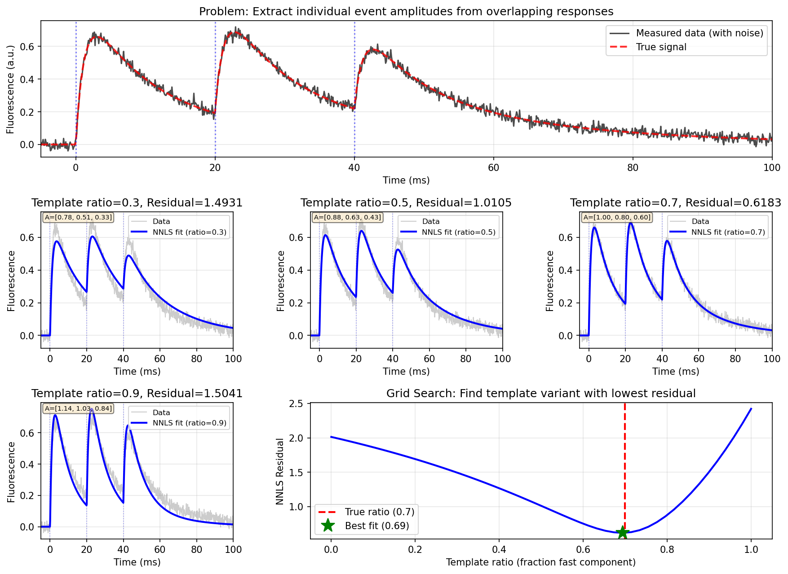
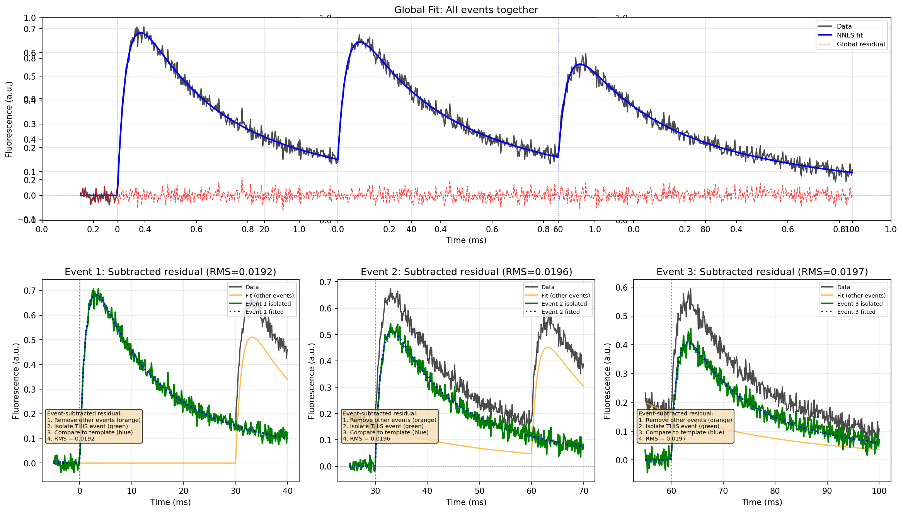
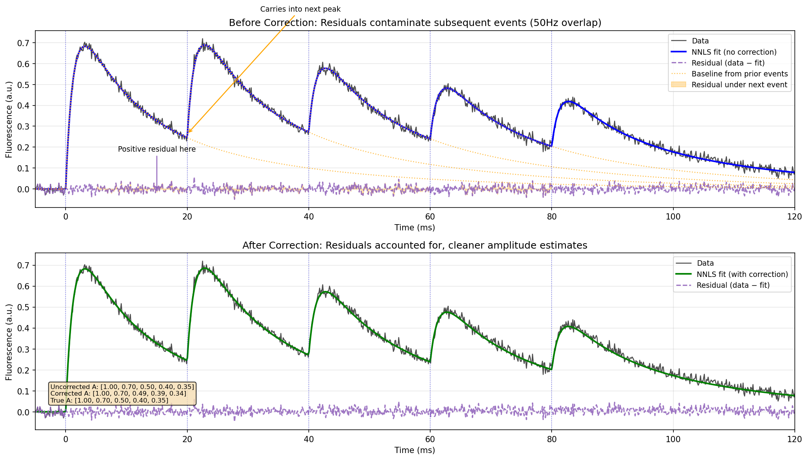
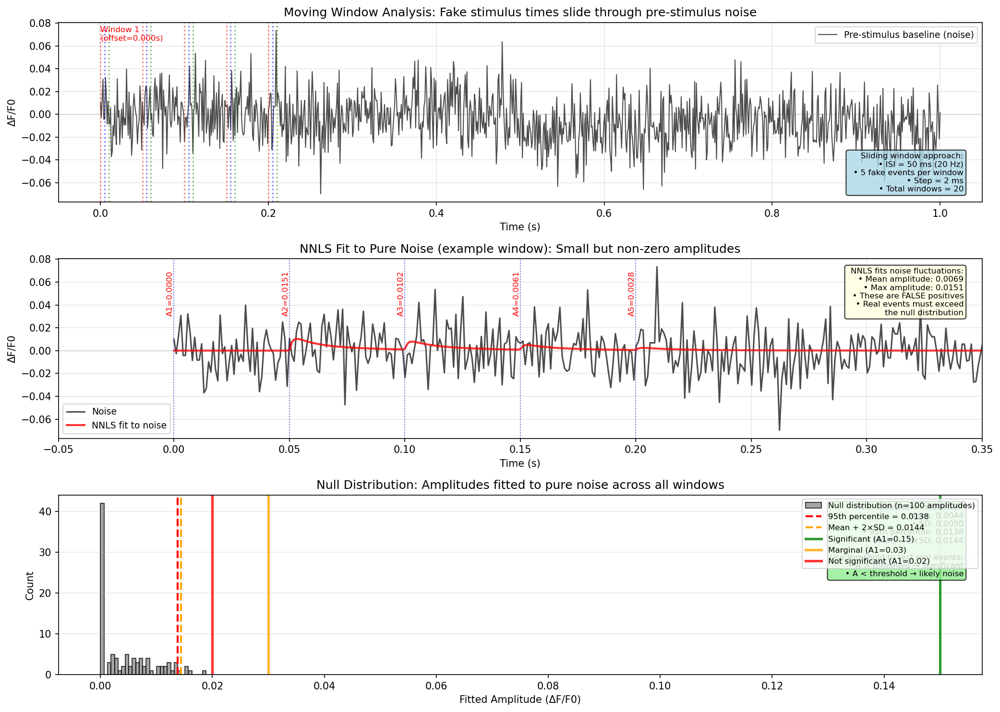
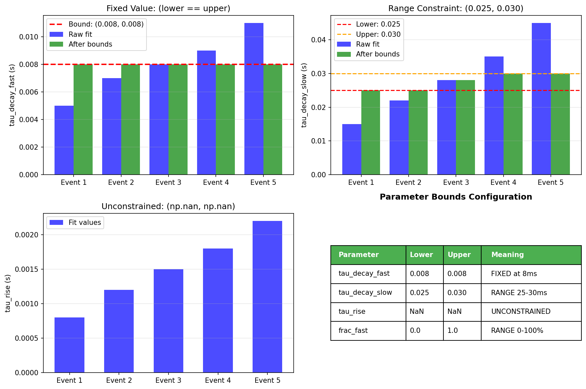

## iGluSnFR Fluorescence Analysis: Methods Overview

We describe a quantitative analysis pipeline for synaptic glutamate imaging with iGluSnFR, designed to recover the amplitudes of individual release events from fluorescence traces in which responses strongly overlap. The core of the approach is a non‑negative least squares (NNLS) fit of a bi‑exponential iGluSnFR template to short trains of stimuli delivered at 20–50 Hz, and the following sections present the processing stages and their associated figures in a methods‑style narrative.

### Experimental context and analysis goal

In line‑scan or frame‑scan experiments, trains of 10 stimuli are delivered at frequencies up to 50 Hz. At these frequencies, individual iGluSnFR S72A responses do not return to baseline before the next stimulus, leading to severe temporal overlap between events. The aim of the pipeline is to estimate, for each pulse in the train, a physically meaningful event amplitude (ΔF/F0) and paired‑pulse ratios, while accounting for variable kinetics, photobleaching and measurement noise. Rather than independently fitting rise and decay parameters for every event—which is ill‑posed when responses overlap—the method constrains the temporal shape of events to a family of templates and uses NNLS to estimate a non‑negative contribution of each template to the observed trace.

### Preprocessing and baseline correction (Figure 1)

Raw fluorescence traces are first preprocessed to obtain a stable baseline and normalized ΔF/F0 signals. For each recording, a pre‑stimulus window preceding the onset of the train (typically 0.4–1.0 s) is identified, and the baseline fluorescence F0 is estimated as the mean or median within this window. This baseline defines the reference level for subsequent normalization and also serves as the region from which noise statistics are derived.

Photobleaching is typically present as a slow exponential decay of baseline fluorescence throughout the trial. To avoid biasing amplitudes, the pipeline fits an exponential bleaching function, $F_{\mathrm{bleach}}(t) = A e^{-t/\tau}$, to the entire trace using a robust loss (Huber‑weighted iteratively reweighted least squares). Time points that coincide with large stimulus‑evoked responses are automatically down‑weighted in this fit, so that the estimated bleaching curve reflects only the slow baseline change. The corrected fluorescence trace is then obtained by subtracting the bleaching component and restoring the baseline to $F_0$.

The corrected trace is expressed as a fractional change relative to baseline,

$$\Delta F/F_0(t) = \frac{F(t) - F_0}{F_0},$$

which makes amplitudes comparable across boutons and recordings and provides an intuitive unit for synaptic strength (e.g. a 50% increase corresponds to ΔF/F0 = 0.5). For visualization and for defining NNLS weights, a Savitzky–Golay filter (typically a 2nd‑order polynomial over a 9‑sample window) is applied to the average trace across trials. This smoothed trace is not used directly for fitting, but it provides a denoised estimate of event timing and helps emphasize peaks in the weighting scheme. The preprocessing workflow and the effect of F0 and bleaching correction on ΔF/F0 are illustrated in the baseline panel figure (`fig7_baseline_estimation.png`) and the preprocessing overview (`fig1_preprocessing_20hz.png`).

*Figure 1. Cartoon of baseline and photobleaching correction. Three identical ΔF/F0 events are placed on a slowly decaying raw fluorescence baseline, an exponential bleaching trend is fitted outside the stimulus epochs, and the corrected trace is normalized to F0 so that event amplitudes are restored while baseline dimming is removed.*

### Bi‑exponential iGluSnFR event model (Figure 2)

Individual iGluSnFR S72A responses are represented by a parametric bi‑exponential template combining a brief rise and two decay components:

$$
	ext{template}(t) = \bigl(1 - e^{-t/\tau_{\mathrm{rise}}}\bigr)
\Bigl[ f_{\mathrm{fast}} e^{-t/\tau_{\mathrm{fast}}} + (1 - f_{\mathrm{fast}}) e^{-t/\tau_{\mathrm{slow}}} \Bigr],\quad t \geq 0.
$$

Here, $\tau_{\mathrm{rise}}$ (≈ 1.4 ms) controls the onset of the signal, while $\tau_{\mathrm{fast}}$ (~8 ms) and $\tau_{\mathrm{slow}}$ (~25–35 ms) capture fast and slow decay components, respectively. The mixing coefficient $f_{\mathrm{fast}} \in [0,1]$ specifies the relative contribution of the fast component. The script `generate_readme_figures.py` illustrates these components and their combinations in `fig2_template_variants.png`: the upper‑left panel shows the full bi‑exponential template together with its fast‑only and slow‑only counterparts; the upper‑right panel displays families of templates obtained by varying $f_{\mathrm{fast}}$ from 0% to 100%. The lower panels visualize temporal jitter variants (see below) and a schematic grid over template ratio and jitter used in the NNLS search; tri‑exp adds a superslow fraction dimension on top of this grid.
For tri‑exponential modeling (`iglusnfr_tri`), a superslow decay term is added to capture post‑train accumulation. The recut fit remains bi‑exponential for reliable fast/slow taus, while the superslow time constant is estimated from the decay after the final event (last peak + 5 ms to baseline or end of trace). If the estimated superslow is too close to the slow component, superslow variants are disabled and the NNLS fit reduces to bi‑exp templates.

*Figure 2. Parametric iGluSnFR event model and its variants. The panels illustrate fast/slow decay components, families of templates obtained by varying the fast fraction, small temporal jitter variants around the stimulus time, and a schematic grid over slow‑component fraction and jitter used to build the NNLS kernel.*

### Template extraction by recutting and oversampling (Figure 3)

To instantiate the event model, the pipeline first constructs a reference template from the data. For each pulse, short snippets around the expected onset are recut from all trials, aligned to the stimulus time, and averaged to give a high‑SNR waveform.

Because imaging frame times are not exactly aligned with the stimulus times, the same underlying response is naturally sampled at slightly different phases across trials. By interpolating these frame‑sampled averages onto a fine, stimulus‑locked time grid—and optionally adding small artificial sub‑timepoint jitter before averaging—the method obtains an effectively oversampled, smooth template without changing the underlying physics. In practice, the fast/slow ratio of this template is then adjusted independently for each event via the NNLS grid over template variants.

*Figure 3. Recutting and oversampling on a stimulus‑locked grid. Coarse imaging samples that are not phase‑locked to the stimulus are first recut around each stimulus and averaged on the original frame grid, then interpolated onto a fine grid aligned exactly to the stimulus time. This improves peak localization while leaving the underlying event shape unchanged; the comparison between peaks and areas highlights that peak height is sensitive to grid placement whereas event area is much more stable.*

### NNLS formulation and justification (Figure 4)

Once a reference template has been obtained, the observed ΔF/F0 trace is modeled as a non‑negative linear combination of time‑shifted template variants. For a train of \(N\) stimuli, each delivered at time \(t_i\), and for a set of template variants indexed by \(v\), a kernel matrix \(K\) is constructed whose columns represent individual basis functions (one per event × variant). The fluorescence trace \(y\) over all sampled time points is then approximated as

$$
y \approx K a,
$$

where \(a\) is a vector of non‑negative coefficients. The amplitudes are obtained by solving the non‑negative least squares problem

$$
\min_{a \ge 0} \; \lVert K a - y \rVert_2^2.
$$

The non‑negativity constraint has a direct physical interpretation: iGluSnFR fluorescence can increase or remain at baseline, but it cannot produce negative responses corresponding to “negative glutamate release”. Enforcing \(a\ge 0\) therefore rules out unphysical solutions in which positive and negative events cancel each other to match the data. Mathematically, the NNLS problem is convex, which guarantees a unique global minimum and avoids the local minima that plague unconstrained multi‑parameter fits of overlapping exponentials.

`fig4_nnls_grid_search.png` provides a synthetic illustration of this procedure. The top panel shows simulated overlapping responses to three pulses, together with the ground‑truth signal. Middle panels display NNLS fits obtained when the wrong or correct fast/slow ratios are used in the template: even when the overall fit to the eye looks similar, the extracted amplitudes and the **NNLS fit residual norm** (the least‑squares cost \(\lVert Ka - y \rVert_2\)) differ. The bottom panel plots this NNLS residual norm as a function of template ratio, revealing a clear minimum at the true underlying ratio. In practice, the implementation extends this one‑dimensional search by simultaneously exploring both template ratio and temporal jitter (see below).

*Figure 4. NNLS as a grid search over candidate templates. A synthetic three‑pulse trace with overlapping responses is fitted with templates spanning different fast/slow ratios; although several fits look acceptable by eye, the residual norm across ratios reveals a clear minimum at the true underlying ratio.*

### Use of integrals rather than peaks (Figure 4 supplemental)

Because events are sampled at finite temporal resolution, peak‑based amplitude estimates are highly sensitive to the relative alignment between the rising phase of the signal and the sampling grid. If the peak falls exactly on a sample, the measured maximum is close to the true amplitude; if it falls between samples, the measured maximum can be substantially lower, and this bias differs from event to event. In contrast, the integral (area under the curve) of the response is much less sensitive to such alignment effects.

Within the NNLS framework, each column of the kernel matrix effectively represents a discretized template whose contribution to the total fluorescence is integrated over time. Minimizing the squared residuals \(\lVert Ka - y \rVert_2^2\) is therefore more closely related to matching the total area of events than to matching instantaneous peaks. The demonstration in the lower‑right panel of `fig6_recut_oversampling.png` quantifies this: misalignment that leads to substantial errors in peak height produces only minor errors in the integrated area. For iGluSnFR at moderate sampling rates, interpreting NNLS coefficients as proportional to event area is thus markedly more robust than reading off raw peaks.

### Template variants and biological variability (Figure 2)

The exact balance between fast and slow decay components is not fixed across synapses or even across pulses within a train. Changes in calcium dynamics, receptor occupancy, temperature, or expression level can all affect apparent kinetics. To account for this biological variability, the pipeline does not assume a single universal $f_{\mathrm{fast}}$, but instead generates a library of template variants by scanning $f_{\mathrm{fast}}$ over a user‑specified grid (for example, 0%, 10%, …, 100% fast component).

In the NNLS formulation, each event in the train is allowed to choose its own preferred template ratio. Concretely, for event \(i\) and variant \(v\), one column of the kernel corresponds to the template with that ratio, time‑shifted to the stimulus time \(t_i\). After solving the NNLS problem, the algorithm inspects the fitted coefficients for all variants associated with a given event and identifies the dominant ratio, which is then reported as a per‑event kinetic summary. This mechanism allows the apparent kinetics to evolve along the train (for example, initial events may be dominated by a fast component, whereas later events may slow as vesicle pools deplete or binding/unbinding changes). For tri‑exp fits, variants are defined by `(frac_slow, frac_superslow_max)` pairs, and superslow ramps monotonically from 0 to its chosen maximum across the train. The range of template variants and their qualitative shapes are visualized in the upper‑right panel of `fig2_template_variants.png`.

### Temporal jitter variants and alignment (Figure 2)

In many experimental configurations, the effective onset of the iGluSnFR response is not perfectly locked to the nominal stimulus time. Sources of timing variability include stimulator jitter, variable synaptic delay, and manual annotation errors. To prevent such variability from being misinterpreted as changes in kinetics or amplitude, the pipeline optionally includes temporal jitter variants.

For each event, the template is shifted by a set of small temporal offsets (e.g. –1.0 to +1.0 ms in 0.25 ms steps). These shifted copies are included as additional columns in the kernel matrix. The NNLS solution then implicitly “chooses” a jitter that best aligns the template to the data for each event. When template and jitter variants are combined, the search space becomes two‑dimensional (fast/slow ratio × jitter), as illustrated schematically in the lower‑right panel of `fig2_template_variants.png`. For tri‑exp fits, superslow fraction adds a third dimension (slow fraction × superslow fraction × jitter). This grid search remains computationally tractable because all variants are fit simultaneously in a single convex NNLS solve.

### Weighting of time points in NNLS

Not all parts of the trace are equally informative about event amplitudes. Regions dominated by noise, baseline, or heavily overlapped tails may contribute less reliable information than the rising and early decay phases. To account for this, the NNLS solver operates on a weighted residual, in which each time point is multiplied by a weight \(w(t)\) before computing the least‑squares cost. Several weighting schemes are implemented, including uniform weights, linearly decaying weights between stimuli, exponential decays based on the estimated decay time, and weights derived from the absolute value of the Savitzky–Golay smoothed signal.

For iGluSnFR trains, weighting based on the smoothed trace (`nnls_weight_mode="savgol"`) is typically used. This emphasizes time points where genuine fluorescence transients are present and down‑weights flat baseline or noise‑dominated regions, improving robustness of the estimated amplitudes without biasing them toward any particular kinetic assumption.

### Per‑event residual analysis (Figure 5)

The pipeline uses the word “residual” in several related but distinct senses:

- **NNLS fit residual norm** (Figure 4): the scalar \(\lVert Ka - y \rVert_2\) used to compare different template grids during fitting.
- **Data–fit residual trace** (purple in the original plots): the time series \(r(t) = y(t) - \hat y(t)\) after a given NNLS solution.
- **Inter‑event baseline residual** (red/white triangles and orange dashed baseline): the contribution of earlier events evaluated at the peak of a later event, which must be subtracted when interpreting peaks or computing PPR.

Residuals in the first two senses are always computed, at every frequency, as the primary diagnostics that the fitted template family is adequate. Besides the global data–fit residual trace, the implementation also constructs event‑subtracted residuals that isolate the contribution of each event in turn: for event \(i\), the fitted contribution of all other events is subtracted from both the data and the global fit, and the remaining mismatch between this isolated trace and the event’s own template is summarized by its root‑mean‑square (RMS) value.

`fig8_event_subtracted_residuals.png` visualizes this procedure. The top panel shows the global fit across the entire train (data in black, fit in blue, global data–fit residual in purple). In the lower panels, each event is examined separately: the orange curve represents the fit of all other events (the “baseline” from earlier pulses), the green curve the isolated signal for the event of interest, and the blue dotted curve the corresponding template. The gray shaded area indicates the event‑subtracted residual, and the panel title reports its RMS. These diagnostics help identify specific events whose kinetics deviate from the chosen model, are contaminated by artifacts, or are poorly constrained by the data; thresholds on RMS can be used to flag events or trials for exclusion without changing the underlying amplitudes.

*Figure 5. Per‑event residual analysis using event subtraction. A global NNLS fit is decomposed into contributions from individual events; subtracting all but one event isolates the signal for that pulse, and comparing it to the fitted template yields an event‑specific residual whose RMS can be used to flag poorly modeled events.*

### Residual‑based correction for 50 Hz trains (Figure 6)

In addition to using residuals as diagnostics, the code can also use them to *modify* amplitudes in the special case where pulses are so close that the slow decay of one event has not yet relaxed when the next one starts. This situation mainly arises at 50 Hz (20 ms inter‑stimulus interval), where even a good bi‑exponential template tends to leave a positive baseline “floor” between pulses that would otherwise be folded into the next amplitude.

For such high‑frequency trains, the pipeline offers an optional residual‑based correction. After an initial NNLS fit, the residual trace is examined immediately before each pulse; if there is a systematic positive residual there, a corresponding offset is subtracted from that event’s amplitude and the fit is recomputed. At lower stimulation frequencies, where events have time to decay back toward baseline, this correction is typically unnecessary and residuals are used only for quality control, not for amplitude adjustment.

`fig5_residual_correction.png` illustrates the effect of this procedure on simulated 50 Hz data. The upper panel highlights how positive residuals between pulses inflate later amplitudes, and the lower panel shows that applying the correction reduces this carry‑over and brings recovered amplitudes closer to their true values.

*Figure 6. Residual‑based amplitude correction for 50 Hz stimulus trains. Simulated 50 Hz data show how positive residuals between pulses can inflate later amplitudes; applying a residual‑based correction reduces this carry‑over and brings the recovered amplitudes closer to their true values.*

### Null distribution of NNLS amplitudes and significance testing (Figure 7)

Even in the absence of synaptic events, NNLS applied to baseline noise will return small non‑zero coefficients, because random fluctuations can mimic a weak template. To distinguish genuine responses from such false positives, the pipeline empirically estimates a null distribution of NNLS amplitudes by repeatedly fitting the same template library to pre‑stimulus baseline segments that contain only noise.

In this procedure, synthetic “stimulus times” are tiled through the baseline at the same inter‑stimulus interval used for the real train. For each offset of this synthetic train, an NNLS fit is performed with the same template and jitter variants as in the real analysis, and the resulting amplitudes are collected. Sliding the synthetic train through the baseline in small steps (e.g. 10 ms) samples a large variety of alignments between noise and templates. The distribution of fitted amplitudes across all windows constitutes the null distribution.

`fig9_null_condition.png` summarizes this approach. The top panel shows a representative baseline trace together with several example positions of the synthetic stimulus train. The middle panel demonstrates that NNLS can produce small, structured fits even to pure noise. The bottom panel displays the aggregated amplitude histogram, from which a detection threshold can be defined (for example, the 95th percentile or mean + 2 standard deviations). Real event amplitudes are then compared to this threshold: amplitudes above threshold are deemed statistically significant, whereas those below are likely attributable to noise.

*Figure 7. Empirical null distribution of NNLS amplitudes from baseline noise. Sliding synthetic stimulus trains through pre‑stimulus noise and fitting them with NNLS yields a distribution of “null” amplitudes; thresholds derived from this distribution are used to decide whether real event amplitudes exceed what is expected from noise alone.*

This null‑based thresholding is particularly important for the first pulse in the train (A1), which enters multiplicatively into paired‑pulse ratios (PPR = A2/A1). If A1 lies close to the noise floor, its uncertainty leads to inflated and unreliable PPRs. The implementation therefore provides options to floor A1 to the null threshold before computing PPRs, or to flag trials where A1 does not significantly exceed noise.

### Parameter bounds and kinetic constraints (Figure 8)

To prevent over‑fitting and unphysical parameter estimates, the pipeline uses explicit lower and upper bounds for all kinetic parameters. Bounds are specified as `(lower, upper)` intervals in the analysis options. A pair with identical lower and upper values fixes a parameter to a known constant, whereas `(np.nan, np.nan)` leaves it unconstrained. For example, in 50 Hz experiments, overlap between events makes reliable estimation of decay time constants from the data alone difficult; in that case, \(\tau_{\mathrm{fast}}\) can be fixed at 8 ms and \(\tau_{\mathrm{slow}}\) constrained to a narrow range around literature values.

`fig3_parameter_bounds.png` visualizes typical use cases. The upper‑left panel shows a parameter forced to a fixed value across events, the upper‑right panel shows raw estimates being clipped into an allowed range, and the lower‑left panel illustrates an unconstrained parameter. The accompanying table summarizes a typical bound configuration for iGluSnFR S72A (e.g. fixed fast decay, moderately constrained slow decay, unconstrained rise time). These bounds can be tuned depending on stimulation frequency and experimental design.

*Figure 8. Illustration of kinetic parameter bounds. Examples show fixed parameters, range‑constrained parameters, unconstrained parameters, and a summary table of typical bounds for the kinetic parameters and fast‑component fraction used in these analyses.*

### Summary of configuration and usage

The analysis routines are exposed through `Feature_extraction.extract_metrics`, which accepts a time vector, a trial × time matrix of fluorescence traces, stimulus timing parameters (train start, inter‑stimulus interval, number of pulses) and an `options` dictionary controlling preprocessing, template generation, NNLS settings, parameter bounds, and plotting. Example configurations for 20 Hz and 50 Hz trains are given in the code snippets in this repository and are reproduced in the documentation figures; they differ mainly in the handling of kinetics (fitted vs. fixed), the inclusion of jitter and template variants, and the use of residual correction.

For single recordings, `demo_single_file.py` demonstrates how to load an individual Excel file, configure an `iglusnfr` event model with template and jitter variants, and visualize raw traces, NNLS fits, residuals, and per‑pulse amplitudes. For large datasets, `demo_batch_process.py` shows how to apply the same analysis settings to multiple folders of files, aggregate amplitude and PPR summaries, and export them to CSV/Excel. The figure‑generation script `generate_readme_figures.py` provides a compact, data‑driven reference for the behavior of each processing step and is a useful starting point for adapting the methods to new experimental paradigms.

The overall workflow is therefore: (i) correct raw traces for bleaching and normalize to ΔF/F0; (ii) construct a high‑SNR template by recutting and oversampling trial‑averaged responses; (iii) generate a family of template and jitter variants; (iv) estimate non‑negative event amplitudes via weighted NNLS; (v) assess per‑event fit quality using event‑subtracted residuals and, for high‑frequency trains, apply residual‑based corrections; and (vi) use an empirically derived null distribution of NNLS amplitudes to set detection thresholds and stabilize paired‑pulse measurements.
