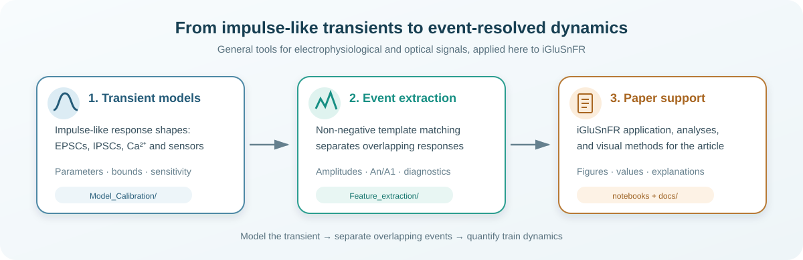
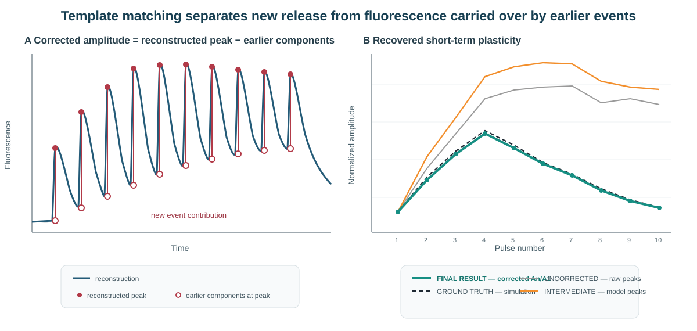

# iGluSnFR response fitting and train analysis

Python tools and notebooks for fitting impulse-like transients and extracting individual responses from overlapping event trains. The methods were developed here for iGluSnFR recordings, but the model library and template-matching approach are also applicable to signals with comparable event-driven kinetics, including EPSCs, IPSCs, calcium-indicator transients, and other fluorescent sensor responses.

This repository currently brings together three main resources:

1. a library of event-fitting models;
2. a tool for extracting responses from stimulus trains by non-negative template matching;
3. analysis and explanatory notebooks supporting the associated cerebellar parallel-fiber study.

The analysis code is under active simplification. The notebooks linked below provide the clearest overview of the current methods and intended workflow.



*The repository connects a reusable library of transient-response models to event-resolved train extraction. Its principal application in this study is iGluSnFR imaging, while the same framework can be adapted to electrophysiological currents and other impulse-like optical signals.*

## Associated study

**Bouton-Specific Diversity of Glutamate Release from Single Parallel Fiber Axons in the Cerebellum**

Théo Rossi¹, Anthime Perrot¹, Aline Huber¹, Bernard Poulain¹, Frédéric Doussau¹*, Antoine M. Valera¹* and Philippe Isope¹*

The repository contains analysis code and supporting material used to study bouton-to-bouton diversity in glutamate release and short-term plasticity along individual cerebellar parallel fibers.

## What is in the repository?

### 1. Event-fitting model library

[`Model_Calibration/event_models.py`](Model_Calibration/event_models.py) is the central registry of available response models. It includes:

- classical single- and double-exponential models;
- alpha, gamma, bilinear, and cooperative models;
- binding and diffusion/clearance models;
- bi- and tri-exponential iGluSnFR models;
- multi-component and heterogeneous cooperative models.

Each registered model defines its callable function, ordered parameter list, fitting bounds, initial-value strategy, and model complexity.

The simplest visual entry point is:

- [Model fitting gallery](docs/model_fitting/Model_Fitting_Gallery.ipynb) — compares every registered model, labels observable fit features, lists parameters and bounds, and shows one-parameter-at-a-time sensitivity.

Additional calibration scripts are available in [`Model_Calibration/`](Model_Calibration/).

### 2. Response-train extraction by non-negative template matching

[`Feature_extraction/extract_metrics.py`](Feature_extraction/extract_metrics.py) extracts pulse-by-pulse responses from trains in which successive fluorescence transients overlap.

The workflow can:

- correct bleaching and express traces as ΔF/F₀;
- calibrate event kinetics from recut responses;
- build kinetic and temporal-jitter template variants;
- fit non-negative event contributions sequentially or simultaneously;
- account for fluorescence carried over from preceding events;
- return per-pulse amplitudes, normalized response profiles, failure estimates, fitted traces, and diagnostic information.

The main programmatic interface is:

```python
from Feature_extraction.extract_metrics import extract_metrics

result = extract_metrics(
    time=time_s,             # shape: (timepoints,)
    trials=traces,           # shape: (timepoints, repetitions)
    train_start=0.5,         # seconds
    isi=0.05,                # seconds; 0.05 = 20 Hz
    n_pulses=10,
    options={},              # replace with a configuration from the demos
)
```

Current usage examples are in:

- [`Feature_extraction/demo_single_file.py`](Feature_extraction/demo_single_file.py)
- [`Feature_extraction/demo_batch_process.py`](Feature_extraction/demo_batch_process.py)
- [`Feature_extraction/demo_residual_diagnostics.py`](Feature_extraction/demo_residual_diagnostics.py)

For a visual explanation of the decomposition:

- [NNLS and sequential-decomposition lecture](docs/nnls_lecture/NNLS_Lecture_Demo.ipynb) — explains template calibration, sequential event construction, kinetic variants, fraction regularization, overlap correction, and baseline-derived thresholds.



*Why the decomposition matters. At each stimulus, the reconstructed peak contains both the new response and the summed tails of earlier events. The open circle marks that earlier-event contribution at the same time point; subtracting it from the peak yields the final pulse amplitude and recovers the underlying short-term-plasticity profile. Adapted from the NNLS lecture.*

### 3. Paper-support notebooks

- [Support figure and manuscript analysis notebook](Support_figure.ipynb) — analyses, figure support, and manuscript-facing values for the associated article.
- [NNLS lecture](docs/nnls_lecture/NNLS_Lecture_Demo.ipynb) — publication-style explanation of the train-extraction method.
- [Fitting-model gallery](docs/model_fitting/Model_Fitting_Gallery.ipynb) — visual reference for the available event models and their parameters.

## Repository map

```text
Model_Calibration/       Event models and kinetic calibration
Feature_extraction/      Train decomposition and metric extraction
docs/
  model_fitting/         Fitting-model gallery
  nnls_lecture/          NNLS/sequential-decomposition lecture
Support_figure.ipynb     Paper-support analysis notebook
paper_support/           Helper modules for Support_figure.ipynb (random-forest, PCA plotting)
smoothing.py             Shared signal-processing helpers used across the packages
dataset_tools/           Dataset organization and conversion utilities
extract_metrics_gui/     CSV-based interface to extract_metrics
tools/                   Maintenance scripts (e.g. README figure generation)
```

The `dataset_tools/`, `extract_metrics_gui/`, `paper_support/`, and `tools/` directories contain supporting utilities and are not required for direct programmatic use of the model library or `extract_metrics`.

## Installation

The environment is defined in [`requirements.txt`](requirements.txt) and currently targets Python 3.11.

```bash
conda create -n glusnfr python=3.11
conda activate glusnfr
pip install -r requirements.txt
```

To inspect the registered models:

```python
from Model_Calibration.event_models import get_event_model

model = get_event_model("iglusnfr_tri")
print(model["params"])
print(model["bounds"])
```

## Data conventions

The low-level extraction function expects:

- a one-dimensional time vector in seconds;
- a two-dimensional array with timepoints in rows and repeated trials in columns;
- the train onset, inter-stimulus interval, and number of pulses;
- an optional `options` dictionary controlling preprocessing, fitting, thresholds, and plotting.

The demo scripts contain the current file-loading and configuration examples. Excel workflows conventionally store repeated traces in separate columns and time in the final column; the CSV GUI expects a `time` or `tim` column and one or more trace columns.
